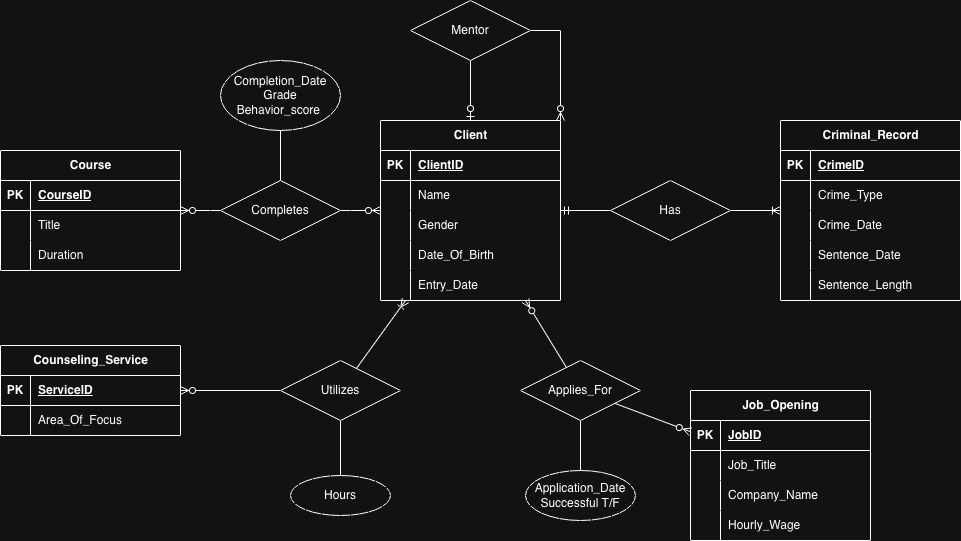

# Reentry Program Database System

## Project Overview
I designed and implemented a relational database to track client progress through a social services reentry program. This project demonstrates my ability to translate complex business requirements into a functional technical architecture.

## Tech Stack
* **Language:** SQL (PostgreSQL/SQL Server)
* **Modeling:** ERD (Entity Relationship Diagram)
* **Skills:** Data Normalization, Referential Integrity, Constraint Logic

## Database Architecture (ERD)

## Key Technical Features
* **Complex Mapping:** Manages relationships between 9 entities, including criminal history and job applications.
* **Referential Integrity:** Enforced through Primary/Foreign Key constraints.
* **Data Validation:** Integrated `CHECK` constraints to ensure data quality (e.g., behavior scores 0-100).
* **Advanced Logic:** Implemented a self-referencing foreign key for Mentor-Client tracking.
